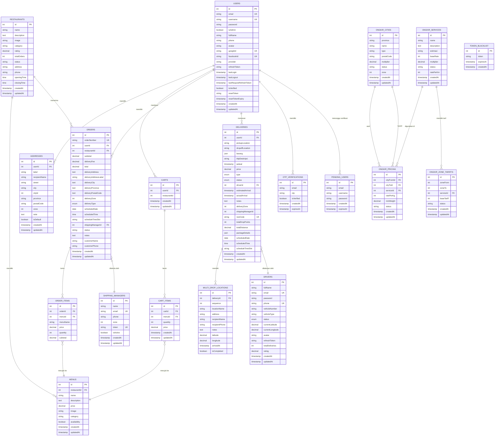

# 🗺️ Flowchart Lengkap - MT Trans Food Delivery

File ini berisi 3 flowchart terpisah untuk memudahkan pemahaman alur sistem:
1. **User Flow** - Alur pengguna (autentikasi, food ordering, profile, orders)
2. **Admin Flow** - Alur admin panel (login, dashboard, manajemen)
3. **Shipping Flow** - Alur pengiriman (cek ongkir, ekspedisi, multi drop, tracking)

---

## 0. 👤 Flowchart User Flow (Alur Pengguna)

**Flowchart ini menampilkan alur lengkap untuk pengguna aplikasi: Autentikasi, Pemesanan Makanan, Profile, dan Orders.**

```mermaid
flowchart TD
    Start([Pengguna Membuka Aplikasi]) --> CheckAuth{Pengguna<br/>Sudah Login?}
    
    %% === AUTHENTICATION FLOW ===
    CheckAuth -->|Tidak| ShowHome[Halaman Utama]
    CheckAuth -->|Ya| MainMenu{Menu Utama}
    
    ShowHome --> HomeAction{Aksi Pengguna}
    HomeAction -->|Masuk| SignIn[Login]
    HomeAction -->|Daftar| SignUp[Registrasi]
    HomeAction -->|Jelajahi| BrowseFood[Jelajahi Makanan]
    
    SignIn --> InputLogin[Input Email/Password]
    InputLogin --> AuthAPI[Auth API<br/>https://be-mt-trans.vercel.app]
    AuthAPI --> AuthSuccess{Berhasil?}
    AuthSuccess -->|Ya| StoreToken[Simpan Token JWT]
    AuthSuccess -->|Tidak| ShowError[Tampilkan Error]
    
    SignUp --> InputReg[Input Data Registrasi]
    InputReg --> RegAPI[Register API]
    RegAPI --> SendOTP[Kirim OTP ke Email]
    SendOTP --> VerifyOTP[Verifikasi OTP]
    VerifyOTP --> OTPValid{OTP Valid?}
    OTPValid -->|Ya| StoreToken
    OTPValid -->|Tidak| ShowError
    
    StoreToken --> MainMenu
    ShowError --> HomeAction
    
    %% === MAIN MENU ===
    MainMenu -->|Food| FoodFlow[Alur Makanan]
    MainMenu -->|Profile| ProfileFlow[Alur Profile]
    MainMenu -->|Orders| OrdersFlow[Alur Orders]
    MainMenu -->|Logout| Logout[Logout]
    
    %% === FOOD ORDERING FLOW ===
    FoodFlow --> DetectLocation[Deteksi Lokasi<br/>Alamat/Geolocation]
    DetectLocation --> FilterResto[Filter Restaurant<br/>Berdasarkan Kota]
    FilterResto --> ShowResto[Tampilkan Restaurant]
    
    ShowResto --> RestoAction{Aksi}
    RestoAction -->|Cari| SearchResto[Cari Restaurant]
    RestoAction -->|Kategori| FilterCategory[Filter Kategori]
    RestoAction -->|Pilih| ViewResto[Lihat Detail Restaurant]
    
    SearchResto --> ShowResto
    FilterCategory --> ShowResto
    
    ViewResto --> ShowMenu[Tampilkan Menu]
    ShowMenu --> AddCart[Tambahkan ke Keranjang]
    AddCart --> UpdateCart[Update Cart]
    UpdateCart --> ContinueShop{Lanjut Belanja?}
    
    ContinueShop -->|Ya| ShowResto
    ContinueShop -->|Tidak| ViewCart[Halaman Keranjang]
    
    ViewCart --> SelectAddr[Pilih Alamat Pengiriman]
    SelectAddr --> LoadAddr[Muat Alamat Tersimpan]
    LoadAddr --> AddrOption{Pilihan Alamat}
    
    AddrOption -->|Gunakan| UseAddr[Gunakan Alamat]
    AddrOption -->|Tambah| NewAddr[Tambah Alamat Baru<br/>dengan Nama Penerima]
    NewAddr --> UseAddr
    
    UseAddr --> CalcFee[Hitung Biaya<br/>Pengiriman: Rp 15.000<br/>Aplikasi: 10%]
    CalcFee --> ShowTotal[Tampilkan Total]
    ShowTotal --> Checkout[Checkout]
    
    Checkout --> ReviewOrder[Tinjau Order]
    ReviewOrder --> ConfirmOrder[Konfirmasi Order]
    ConfirmOrder --> CreateOrder[Create Order API]
    
    CreateOrder --> OrderCreated{Order<br/>Berhasil?}
    OrderCreated -->|Ya| ClearCart[Bersihkan Keranjang]
    OrderCreated -->|Tidak| ShowError
    ClearCart --> OrderSuccess[Order Berhasil<br/>Nomor: MT-XXXXXX]
    OrderSuccess --> OrdersFlow
    
    %% === ORDERS FLOW ===
    OrdersFlow --> ViewOrders[Lihat Semua Orders]
    ViewOrders --> OrderDetail{Detail Order}
    OrderDetail -->|Lihat| ShowDetail[Tampilkan Detail<br/>- Nomor Order: MT-XXXXXX<br/>- Nama Penerima<br/>- Label Alamat<br/>- Alamat Lengkap<br/>- Status Order<br/>- Biaya Aplikasi]
    OrderDetail -->|Lacak| TrackOrder[Lacak Order]
    OrderDetail -->|Kembali| MainMenu
    
    TrackOrder --> ShowStatus[Status Pengiriman<br/>Pending → Confirmed →<br/>Preparing → On The Way →<br/>Delivered]
    ShowStatus --> MainMenu
    
    %% === PROFILE FLOW ===
    ProfileFlow --> ProfileMenu{Menu Profile}
    ProfileMenu -->|Edit Profile| EditProfile[Edit Profile]
    ProfileMenu -->|Alamat| ManageAddr[Kelola Alamat]
    ProfileMenu -->|Ubah Password| ChangePass[Ubah Password]
    ProfileMenu -->|Kembali| MainMenu
    
    EditProfile --> InputProfile[Input Data Profile]
    InputProfile --> SaveProfile[Simpan Profile]
    SaveProfile --> ProfileSaved[Profile Tersimpan]
    ProfileSaved --> ProfileMenu
    
    ChangePass --> InputOldPass[Input Password Lama]
    InputOldPass --> InputNewPass[Input Password Baru]
    InputNewPass --> ConfirmNewPass[Konfirmasi Password Baru]
    ConfirmNewPass --> UpdatePass[Update Password API]
    UpdatePass --> PassUpdated{Berhasil?}
    PassUpdated -->|Ya| PassSuccess[Password Diubah]
    PassUpdated -->|Tidak| ShowError
    PassSuccess --> ProfileMenu
    
    ManageAddr --> AddrList[Daftar Alamat]
    AddrList --> AddrAction{Aksi}
    AddrAction -->|Tambah| AddNewAddr[Tambah Alamat<br/>dengan Nama Penerima]
    AddrAction -->|Edit| EditAddr[Edit Alamat]
    AddrAction -->|Hapus| DeleteAddr[Hapus Alamat]
    AddrAction -->|Kembali| ProfileMenu
    
    AddNewAddr --> InputAddrForm[Input Form Alamat<br/>- Nama Penerima<br/>- Label Alamat<br/>- Alamat Lengkap<br/>- Kota, Provinsi<br/>- Kode Pos<br/>- Zone]
    InputAddrForm --> SaveAddr[Simpan Alamat API]
    SaveAddr --> AddrSaved[Alamat Tersimpan]
    AddrSaved --> AddrList
    
    EditAddr --> LoadAddrData[Muat Data Alamat]
    LoadAddrData --> InputAddrForm
    DeleteAddr --> ConfirmDelete{Konfirmasi Hapus?}
    ConfirmDelete -->|Ya| DeleteAddrAPI[Hapus Alamat API]
    ConfirmDelete -->|Tidak| AddrList
    DeleteAddrAPI --> AddrDeleted[Alamat Dihapus]
    AddrDeleted --> AddrList
    
    Logout --> ClearToken[Hapus Token JWT]
    ClearToken --> ShowHome
    
    %% === STYLING ===
    style Start fill:#e1f5ff
    style StoreToken fill:#c8e6c9
    style OrderSuccess fill:#c8e6c9
    style ProfileSaved fill:#c8e6c9
    style PassSuccess fill:#c8e6c9
    style AddrSaved fill:#c8e6c9
    style ShowError fill:#ffcdd2
    style Logout fill:#ffcdd2
```



---

## 1. 🔧 Flowchart Admin Flow (Alur Admin Panel)

**Flowchart ini menampilkan alur lengkap untuk admin panel: Login, Dashboard, Manajemen Orders/Users/Restaurants, Analytics, dan Settings.**

```mermaid
flowchart TD
    Start([Admin Membuka Panel]) --> AdminLogin[Login Admin]
    
    AdminLogin --> InputAdminCred[Input Email/Password Admin]
    InputAdminCred --> AuthAdminAPI[Auth Admin API<br/>https://be-mt-trans.vercel.app]
    AuthAdminAPI --> ValidateAdmin{Admin Valid?}
    ValidateAdmin -->|Tidak| ShowError[Tampilkan Error]
    ValidateAdmin -->|Ya| StoreAdminToken[Simpan Admin Token]
    
    StoreAdminToken --> AdminDashboard[Dashboard Admin<br/>https://mt-admin.vercel.app]
    ShowError --> AdminLogin
    
    AdminDashboard --> AdminMenu{Menu Admin}
    AdminMenu -->|Orders| AdminOrders[Manajemen Orders]
    AdminMenu -->|Users| AdminUsers[Manajemen Users]
    AdminMenu -->|Restaurants| AdminResto[Manajemen Restaurants]
    AdminMenu -->|Deliveries| AdminDelivery[Pelacakan Deliveries]
    AdminMenu -->|Analytics| AdminAnalytics[Analytics Dashboard]
    AdminMenu -->|Ongkir| AdminOngkir[Manajemen Ongkir]
    AdminMenu -->|Settings| AdminSettings[Pengaturan]
    AdminMenu -->|Logout| AdminLogout[Logout Admin]
    
    %% === ORDERS MANAGEMENT ===
    AdminOrders --> ViewAllOrders[Lihat Semua Orders]
    ViewAllOrders --> AdminOrderAction{Aksi}
    AdminOrderAction -->|Detail| ViewOrderDetails[Lihat Detail Order<br/>- Nomor Order: MT-XXXXXX<br/>- Nama Penerima<br/>- Label Alamat<br/>- Alamat Lengkap<br/>- Kota, Provinsi, Kode Pos<br/>- Zone<br/>- Nomor Telepon<br/>- Items dan Harga<br/>- Subtotal<br/>- Biaya Aplikasi 10%<br/>- Biaya Pengiriman<br/>- Total]
    AdminOrderAction -->|Update Status| UpdateStatus[Update Status Order]
    AdminOrderAction -->|Filter| FilterOrders[Filter Orders<br/>- Status<br/>- Tanggal<br/>- Restaurant]
    AdminOrderAction -->|Kembali| AdminDashboard
    
    ViewOrderDetails --> BackToOrders[Kembali ke Orders]
    BackToOrders --> ViewAllOrders
    
    UpdateStatus --> SelectNewStatus{Pilih Status Baru}
    SelectNewStatus -->|Pending| SetPending[Set Status: Pending]
    SelectNewStatus -->|Confirmed| SetConfirmed[Set Status: Confirmed]
    SelectNewStatus -->|Preparing| SetPreparing[Set Status: Preparing]
    SelectNewStatus -->|On The Way| SetOnWay[Set Status: On The Way]
    SelectNewStatus -->|Delivered| SetDelivered[Set Status: Delivered]
    SelectNewStatus -->|Cancelled| SetCancelled[Set Status: Cancelled]
    
    SetPending --> SaveStatusDB[Simpan ke Database]
    SetConfirmed --> SaveStatusDB
    SetPreparing --> SaveStatusDB
    SetOnWay --> SaveStatusDB
    SetDelivered --> SaveStatusDB
    SetCancelled --> SaveStatusDB
    
    SaveStatusDB --> RefreshOrders[Refresh Daftar Orders]
    RefreshOrders --> ViewAllOrders
    
    FilterOrders --> ApplyFilter[Terapkan Filter]
    ApplyFilter --> ViewAllOrders
    
    %% === USERS MANAGEMENT ===
    AdminUsers --> ViewAllUsers[Lihat Semua Users]
    ViewAllUsers --> UserAction{Aksi}
    UserAction -->|Detail| ViewUserDetails[Lihat Detail User<br/>- Nama, Email, Telepon<br/>- Status Akun<br/>- Total Orders<br/>- Alamat Tersimpan]
    UserAction -->|Aktifkan/Nonaktifkan| ToggleUser[Toggle Status User]
    UserAction -->|Filter| FilterUsers[Filter Users]
    UserAction -->|Kembali| AdminDashboard
    
    ViewUserDetails --> BackToUsers[Kembali ke Users]
    BackToUsers --> ViewAllUsers
    
    ToggleUser --> ConfirmToggle{Konfirmasi<br/>Toggle?}
    ConfirmToggle -->|Ya| UpdateUserStatus[Update Status User API]
    ConfirmToggle -->|Tidak| ViewAllUsers
    UpdateUserStatus --> UserUpdated[Status User Diupdate]
    UserUpdated --> ViewAllUsers
    
    FilterUsers --> ApplyUserFilter[Terapkan Filter]
    ApplyUserFilter --> ViewAllUsers
    
    %% === RESTAURANTS MANAGEMENT ===
    AdminResto --> ViewAllResto[Lihat Semua Restaurants]
    ViewAllResto --> RestoActionAdmin{Aksi}
    RestoActionAdmin -->|Detail| ViewRestoDetails[Lihat Detail Restaurant<br/>- Nama, Alamat, Kota<br/>- Kategori<br/>- Status<br/>- Total Orders]
    RestoActionAdmin -->|Edit| EditResto[Edit Restaurant]
    RestoActionAdmin -->|Menu| ViewMenus[Lihat Menu Restaurant]
    RestoActionAdmin -->|Aktifkan/Nonaktifkan| ToggleResto[Toggle Status Restaurant]
    RestoActionAdmin -->|Kembali| AdminDashboard
    
    ViewRestoDetails --> BackToResto[Kembali ke Restaurants]
    BackToResto --> ViewAllResto
    
    EditResto --> InputRestoData[Input Data Restaurant]
    InputRestoData --> SaveRestoAPI[Simpan Restaurant API]
    SaveRestoAPI --> RestoSaved[Restaurant Tersimpan]
    RestoSaved --> ViewAllResto
    
    ViewMenus --> ShowMenuList[Daftar Menu Restaurant]
    ShowMenuList --> MenuAction{Aksi Menu}
    MenuAction -->|Tambah Menu| AddMenu[Tambah Menu Baru]
    MenuAction -->|Edit Menu| EditMenu[Edit Menu]
    MenuAction -->|Hapus Menu| DeleteMenu[Hapus Menu]
    MenuAction -->|Kembali| ViewAllResto
    
    AddMenu --> InputMenuData[Input Data Menu]
    InputMenuData --> SaveMenuAPI[Simpan Menu API]
    SaveMenuAPI --> MenuSaved[Menu Tersimpan]
    MenuSaved --> ShowMenuList
    
    EditMenu --> LoadMenuData[Muat Data Menu]
    LoadMenuData --> InputMenuData
    
    DeleteMenu --> ConfirmDeleteMenu{Konfirmasi Hapus?}
    ConfirmDeleteMenu -->|Ya| DeleteMenuAPI[Hapus Menu API]
    ConfirmDeleteMenu -->|Tidak| ShowMenuList
    DeleteMenuAPI --> MenuDeleted[Menu Dihapus]
    MenuDeleted --> ShowMenuList
    
    ToggleResto --> ConfirmToggleResto{Konfirmasi<br/>Toggle?}
    ConfirmToggleResto -->|Ya| UpdateRestoStatus[Update Status Restaurant API]
    ConfirmToggleResto -->|Tidak| ViewAllResto
    UpdateRestoStatus --> RestoUpdated[Status Restaurant Diupdate]
    RestoUpdated --> ViewAllResto
    
    %% === DELIVERIES MANAGEMENT ===
    AdminDelivery --> ViewAllDelivery[Lihat Semua Deliveries]
    ViewAllDelivery --> DeliveryActionAdmin{Aksi}
    DeliveryActionAdmin -->|Lacak| TrackDeliveryAdmin[Lacak Pengiriman<br/>- Status Real-time<br/>- Lokasi Driver<br/>- Estimasi Waktu]
    DeliveryActionAdmin -->|Update| UpdateDeliveryStatus[Update Status Delivery]
    DeliveryActionAdmin -->|Kembali| AdminDashboard
    
    TrackDeliveryAdmin --> ShowDeliveryMap[Peta Pengiriman]
    ShowDeliveryMap --> ViewAllDelivery
    
    UpdateDeliveryStatus --> SelectDeliveryStatus{Pilih Status}
    SelectDeliveryStatus -->|Assigned| SetAssigned[Set: Assigned]
    SelectDeliveryStatus -->|Picked Up| SetPickedUp[Set: Picked Up]
    SelectDeliveryStatus -->|In Transit| SetInTransit[Set: In Transit]
    SelectDeliveryStatus -->|Delivered| SetDeliveredDelivery[Set: Delivered]
    
    SetAssigned --> SaveDeliveryStatus[Simpan Status Delivery]
    SetPickedUp --> SaveDeliveryStatus
    SetInTransit --> SaveDeliveryStatus
    SetDeliveredDelivery --> SaveDeliveryStatus
    
    SaveDeliveryStatus --> DeliveryUpdated[Status Delivery Diupdate]
    DeliveryUpdated --> ViewAllDelivery
    
    %% === ANALYTICS ===
    AdminAnalytics --> ViewCharts[Lihat Chart Analytics]
    ViewCharts --> ChartType{Jenis Chart}
    ChartType -->|Pendapatan| RevenueChart[Chart Pendapatan<br/>Harian, Bulanan, Tahunan]
    ChartType -->|Orders| OrdersChart[Chart Orders<br/>Total, Status, Trend]
    ChartType -->|Users| UsersChart[Chart Users<br/>Registrasi, Aktif]
    ChartType -->|Restaurants| RestoChart[Chart Restaurants<br/>Total, Aktif, Kategori]
    ChartType -->|Kembali| AdminDashboard
    
    RevenueChart --> ExportData{Ekspor Data?}
    OrdersChart --> ExportData
    UsersChart --> ExportData
    RestoChart --> ExportData
    
    ExportData -->|Ya| DownloadReport[Download Laporan]
    ExportData -->|Tidak| ViewCharts
    DownloadReport --> ViewCharts
    
    %% === ONGKIR MANAGEMENT ===
    AdminOngkir --> OngkirMenuAdmin{Menu Ongkir}
    OngkirMenuAdmin -->|Provinces| ManageProv[Kelola Provinsi<br/>- Tambah<br/>- Edit<br/>- Hapus]
    OngkirMenuAdmin -->|Cities| ManageCity[Kelola Kota<br/>- Tambah<br/>- Edit<br/>- Hapus]
    OngkirMenuAdmin -->|Services| ManageService[Kelola Layanan<br/>- Kirim Barang<br/>- Ekspedisi Lokal<br/>- Multi Drop]
    OngkirMenuAdmin -->|Calculator| OngkirCalc[Kalkulator Ongkir<br/>Test Perhitungan]
    OngkirMenuAdmin -->|Kembali| AdminDashboard
    
    ManageProv --> ProvList[Daftar Provinsi]
    ProvList --> ProvAction{Aksi}
    ProvAction -->|Tambah| AddProv[Tambah Provinsi]
    ProvAction -->|Edit| EditProv[Edit Provinsi]
    ProvAction -->|Hapus| DeleteProv[Hapus Provinsi]
    ProvAction -->|Kembali| OngkirMenuAdmin
    
    ManageCity --> CityList[Daftar Kota]
    CityList --> CityAction{Aksi}
    CityAction -->|Tambah| AddCity[Tambah Kota]
    CityAction -->|Edit| EditCity[Edit Kota]
    CityAction -->|Hapus| DeleteCity[Hapus Kota]
    CityAction -->|Kembali| OngkirMenuAdmin
    
    ManageService --> ServiceList[Daftar Layanan]
    ServiceList --> ServiceAction{Aksi}
    ServiceAction -->|Tambah| AddService[Tambah Layanan]
    ServiceAction -->|Edit| EditService[Edit Layanan]
    ServiceAction -->|Hapus| DeleteService[Hapus Layanan]
    ServiceAction -->|Kembali| OngkirMenuAdmin
    
    OngkirCalc --> InputCalcData[Input Data Kalkulasi<br/>- Asal<br/>- Tujuan<br/>- Berat/Dimensi]
    InputCalcData --> CalculateOngkir[Hitung Ongkir]
    CalculateOngkir --> ShowCalcResult[Tampilkan Hasil]
    ShowCalcResult --> OngkirMenuAdmin
    
    %% === SETTINGS ===
    AdminSettings --> SettingsMenu{Menu Settings}
    SettingsMenu -->|Payment Methods| PaymentSettings[Metode Pembayaran<br/>Cash on Delivery Only]
    SettingsMenu -->|General| GeneralSettings[Pengaturan Umum]
    SettingsMenu -->|Kembali| AdminDashboard
    
    PaymentSettings --> ViewPaymentMethods[Lihat Metode Pembayaran]
    ViewPaymentMethods --> PaymentAction{Aksi}
    PaymentAction -->|Aktifkan COD| EnableCOD[Aktifkan Cash on Delivery]
    PaymentAction -->|Kembali| SettingsMenu
    
    EnableCOD --> PaymentSaved[Pengaturan Tersimpan]
    PaymentSaved --> SettingsMenu
    
    GeneralSettings --> ViewGeneralSettings[Lihat Pengaturan Umum]
    ViewGeneralSettings --> UpdateGeneral[Update Pengaturan]
    UpdateGeneral --> GeneralSaved[Pengaturan Tersimpan]
    GeneralSaved --> SettingsMenu
    
    AdminLogout --> ClearAdminToken[Hapus Admin Token]
    ClearAdminToken --> AdminLogin
    
    %% === STYLING ===
    style Start fill:#e1f5ff
    style AdminDashboard fill:#fff4e1
    style StoreAdminToken fill:#c8e6c9
    style RestoSaved fill:#c8e6c9
    style MenuSaved fill:#c8e6c9
    style UserUpdated fill:#c8e6c9
    style RestoUpdated fill:#c8e6c9
    style DeliveryUpdated fill:#c8e6c9
    style PaymentSaved fill:#c8e6c9
    style GeneralSaved fill:#c8e6c9
    style ShowError fill:#ffcdd2
    style AdminLogout fill:#ffcdd2
    style SaveStatusDB fill:#fff9c4
    style SaveRestoAPI fill:#fff9c4
    style SaveMenuAPI fill:#fff9c4
```



---

## 2. 🚚 Flowchart Shipping Flow (Alur Pengiriman)

**Flowchart ini menampilkan alur lengkap untuk layanan pengiriman: Cek Ongkir, Ekspedisi Lokal, Multi Drop, dan Tracking.**

```mermaid
flowchart TD
    Start([User Butuh Layanan Pengiriman]) --> ServiceType{Jenis<br/>Layanan?}
    
    %% === CEK ONGKIR (KIRIM BARANG) ===
    ServiceType -->|Kirim Barang| CekOngkir[Halaman Cek Ongkir]
    ServiceType -->|Ekspedisi Lokal| EkspedisiFlow[Alur Ekspedisi]
    ServiceType -->|Multi Drop| MultiDropFlow[Alur Multi Drop]
    
    CekOngkir --> InputOrigin[Input Alamat Asal<br/>- Provinsi<br/>- Kota<br/>- Kode Pos]
    InputOrigin --> InputDestination[Input Alamat Tujuan<br/>- Provinsi<br/>- Kota<br/>- Kode Pos]
    InputDestination --> SelectService[Pilih Layanan Pengiriman<br/>- Regular<br/>- Express<br/>- Same Day]
    SelectService --> InputWeight[Input Berat Paket<br/>dalam kg]
    InputWeight --> CalculateOngkir[Hitung Biaya Ongkir API<br/>https://be-mt-trans.vercel.app]
    
    CalculateOngkir --> ShowCost[Tampilkan Biaya Pengiriman<br/>- Biaya Dasar<br/>- Biaya Tambahan<br/>- Total]
    ShowCost --> UserDecision{Keputusan<br/>Pengguna}
    UserDecision -->|Pesan Pengiriman| CreateDelivery[Buat Order Pengiriman]
    UserDecision -->|Ubah Data| InputOrigin
    UserDecision -->|Batal| BackToHome[Kembali ke Home]
    
    CreateDelivery --> ValidateAddress{Alamat<br/>Valid?}
    ValidateAddress -->|Tidak| ShowError[Tampilkan Error]
    ValidateAddress -->|Ya| InputRecipient[Input Data Penerima<br/>- Nama Penerima<br/>- Nomor Telepon<br/>- Alamat Lengkap]
    ShowError --> InputOrigin
    
    InputRecipient --> SaveDeliveryOrder[Simpan Order Pengiriman<br/>ke Database]
    SaveDeliveryOrder --> GenerateDeliveryNum[Generate Nomor Pengiriman<br/>SHIP-XXXXXX]
    GenerateDeliveryNum --> AssignShippingManager[Assign Shipping Manager<br/>Berdasarkan Zone]
    
    AssignShippingManager --> DeliveryStatus{Status<br/>Pengiriman}
    DeliveryStatus -->|Pending| NotifySM[Notifikasi Shipping Manager]
    DeliveryStatus -->|Assigned| AssignDriver[Assign Driver]
    DeliveryStatus -->|Picked Up| UpdatePickedUp[Update: Paket Diambil]
    DeliveryStatus -->|In Transit| TrackDelivery[Lacak Status Pengiriman]
    DeliveryStatus -->|Delivered| CompleteDelivery[Pengiriman Selesai]
    DeliveryStatus -->|Cancelled| CancelDelivery[Pengiriman Dibatalkan]
    
    NotifySM --> WaitSMConfirmation[Tunggu Konfirmasi SM]
    WaitSMConfirmation --> SMAction{Aksi SM}
    SMAction -->|Terima| AssignDriver
    SMAction -->|Tolak| CancelDelivery
    
    AssignDriver --> NotifyDriver[Notifikasi Driver]
    NotifyDriver --> DriverPickup{Driver<br/>Ambil Paket?}
    DriverPickup -->|Ya| UpdatePickedUp
    DriverPickup -->|Tidak| WaitDriver[Tunggu Driver]
    WaitDriver --> DriverPickup
    
    UpdatePickedUp --> UpdateInTransit[Update: Dalam Perjalanan]
    UpdateInTransit --> TrackDelivery
    
    TrackDelivery --> ShowTrackingInfo[Info Tracking<br/>- Status Real-time<br/>- Lokasi Driver<br/>- Estimasi Waktu Tiba]
    ShowTrackingInfo --> DeliveryProgress{Kemajuan<br/>Pengiriman}
    DeliveryProgress -->|Masih Dalam Perjalanan| TrackDelivery
    DeliveryProgress -->|Sudah Sampai| UpdateArrived[Update: Sudah Sampai]
    
    UpdateArrived --> ConfirmDelivery{Konfirmasi<br/>Penerima}
    ConfirmDelivery -->|Diterima| CompleteDelivery
    ConfirmDelivery -->|Tidak Diterima| HandleIssue[Tangani Masalah]
    
    CompleteDelivery --> UpdateDelivered[Update: Terkirim]
    UpdateDelivered --> NotifyUser[Notifikasi User]
    NotifyUser --> DeliveryComplete[Pengiriman Selesai]
    
    HandleIssue --> ResolveIssue{Resolve<br/>Issue?}
    ResolveIssue -->|Ya| CompleteDelivery
    ResolveIssue -->|Tidak| EscalateIssue[Eskalasi Masalah]
    EscalateIssue --> AdminReview[Review Admin]
    AdminReview --> ResolveIssue
    
    CancelDelivery --> UpdateCancelled[Update: Dibatalkan]
    UpdateCancelled --> NotifyCancellation[Notifikasi Pembatalan]
    NotifyCancellation --> DeliveryCancelled[Pengiriman Dibatalkan]
    
    %% === EKSPEDISI LOKAL ===
    EkspedisiFlow --> InputPackageInfo[Input Info Paket<br/>- Berat (kg)<br/>- Panjang (cm)<br/>- Lebar (cm)<br/>- Tinggi (cm)<br/>- Nilai Barang]
    InputPackageInfo --> InputOriginEks[Input Alamat Asal]
    InputOriginEks --> InputDestEks[Input Alamat Tujuan]
    InputDestEks --> SelectServiceEks[Pilih Layanan Ekspedisi]
    SelectServiceEks --> CalculateEkspedisi[Hitung Biaya Ekspedisi<br/>Berdasarkan Berat, Dimensi, Nilai]
    
    CalculateEkspedisi --> ShowEkspedisiCost[Tampilkan Biaya Ekspedisi<br/>- Biaya Berat<br/>- Biaya Dimensi<br/>- Asuransi (jika ada)<br/>- Total]
    ShowEkspedisiCost --> UserDecision
    
    %% === MULTI DROP ===
    MultiDropFlow --> InputOriginMulti[Input Alamat Asal]
    InputOriginMulti --> InputMultipleDest[Input Beberapa Tujuan<br/>Minimal 2 Alamat]
    InputMultipleDest --> AddMoreDest{Tambah<br/>Tujuan?}
    AddMoreDest -->|Ya| InputMultipleDest
    AddMoreDest -->|Tidak| SelectServiceMulti[Pilih Layanan]
    SelectServiceMulti --> InputWeightMulti[Input Berat per Tujuan]
    InputWeightMulti --> CalculateMulti[Hitung Biaya Multi Drop<br/>Biaya Dasar + Biaya per Drop]
    
    CalculateMulti --> ShowMultiCost[Tampilkan Biaya Multi Drop<br/>- Biaya Dasar<br/>- Biaya per Drop<br/>- Total Drops<br/>- Total Biaya]
    ShowMultiCost --> UserDecision
    
    BackToHome --> End([Kembali ke Home])
    DeliveryComplete --> End
    DeliveryCancelled --> End
    
    %% === STYLING ===
    style Start fill:#e1f5ff
    style CompleteDelivery fill:#c8e6c9
    style DeliveryComplete fill:#c8e6c9
    style ShowError fill:#ffcdd2
    style CancelDelivery fill:#ffcdd2
    style DeliveryCancelled fill:#ffcdd2
    style AssignShippingManager fill:#fff9c4
    style SaveDeliveryOrder fill:#fff9c4
    style TrackDelivery fill:#e3f2fd
```

---

## 📝 Penjelasan Flowchart

### 👤 **User Flow**
- **Autentikasi**: Login, Registrasi, Verifikasi OTP
- **Pemesanan Makanan**: Deteksi lokasi, browse restaurant, tambah ke cart, checkout
- **Profile**: Edit profile, kelola alamat, ubah password
- **Orders**: Lihat orders, detail order, lacak order

### 🔧 **Admin Flow**
- **Login Admin**: Autentikasi admin
- **Dashboard**: Overview analytics
- **Manajemen Orders**: Lihat, detail, update status order
- **Manajemen Users**: Lihat, detail, toggle status user
- **Manajemen Restaurants**: Lihat, edit, kelola menu restaurant
- **Pelacakan Deliveries**: Lacak dan update status delivery
- **Analytics**: Chart dan statistik pendapatan, orders, users, restaurants
- **Manajemen Ongkir**: Kelola provinsi, kota, layanan ongkir
- **Settings**: Pengaturan sistem dan metode pembayaran

### 🚚 **Shipping Flow**
- **Cek Ongkir**: Input alamat, pilih layanan, hitung biaya pengiriman
- **Ekspedisi Lokal**: Input paket (berat, dimensi, nilai), hitung biaya ekspedisi
- **Multi Drop**: Input beberapa tujuan, hitung biaya multi drop
- **Tracking**: Lacak status pengiriman real-time dari Pending hingga Delivered

---

## 🎯 Cara Menggunakan

1. Buka [Mermaid Live Editor](https://mermaid.live/)
2. Salin kode flowchart yang diinginkan (User Flow, Admin Flow, atau Shipping Flow)
3. Tempel ke editor
4. Flowchart akan langsung ter-render
5. Anda bisa zoom in/out untuk melihat detail
6. Export sebagai PNG, SVG, atau share link

---

## 3. 📊 ERD Database Lengkap

**Entity Relationship Diagram lengkap untuk seluruh sistem MT Trans Food Delivery**



---

**Flowchart Lengkap MT Trans Food Delivery**
**Dibuat**: 2025
