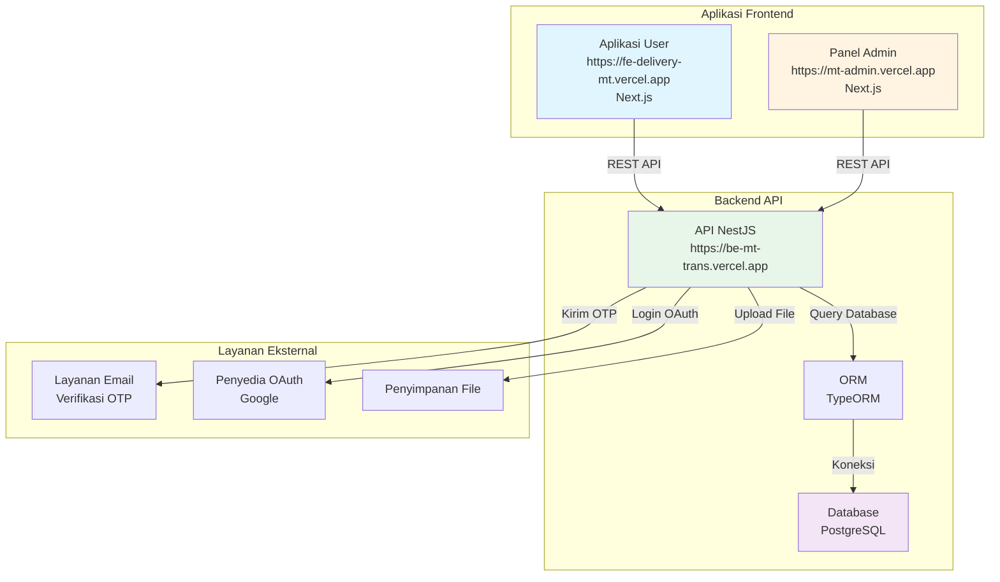
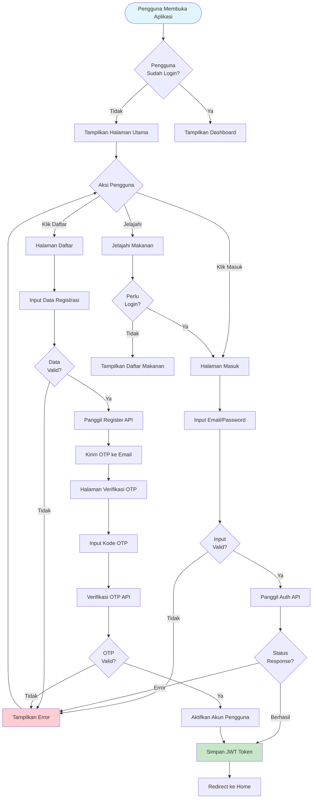
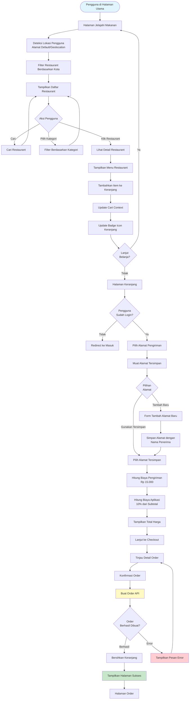
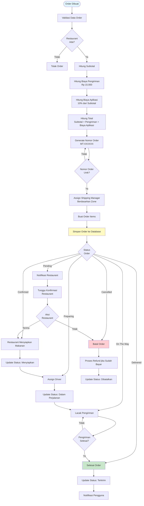
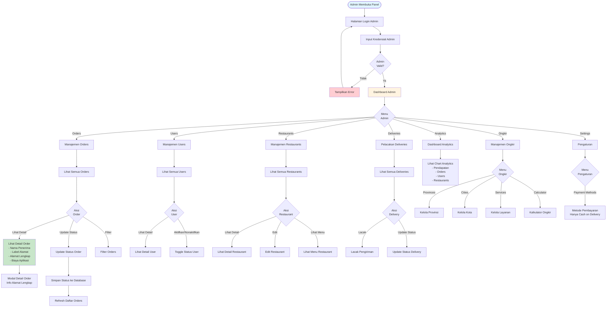
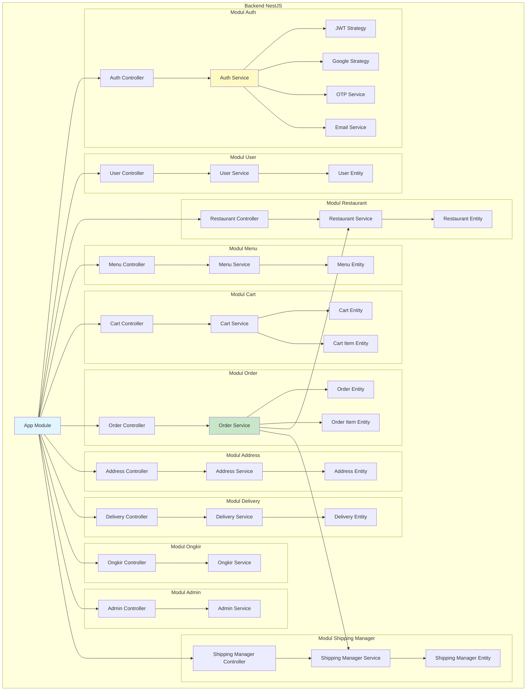
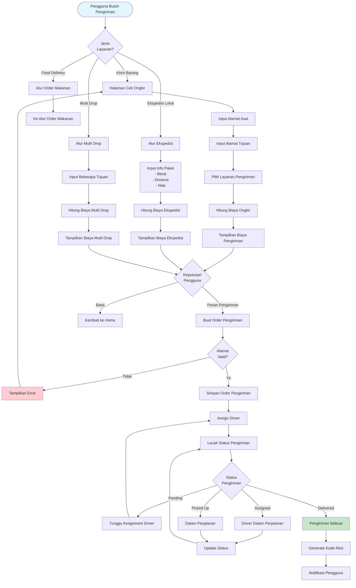
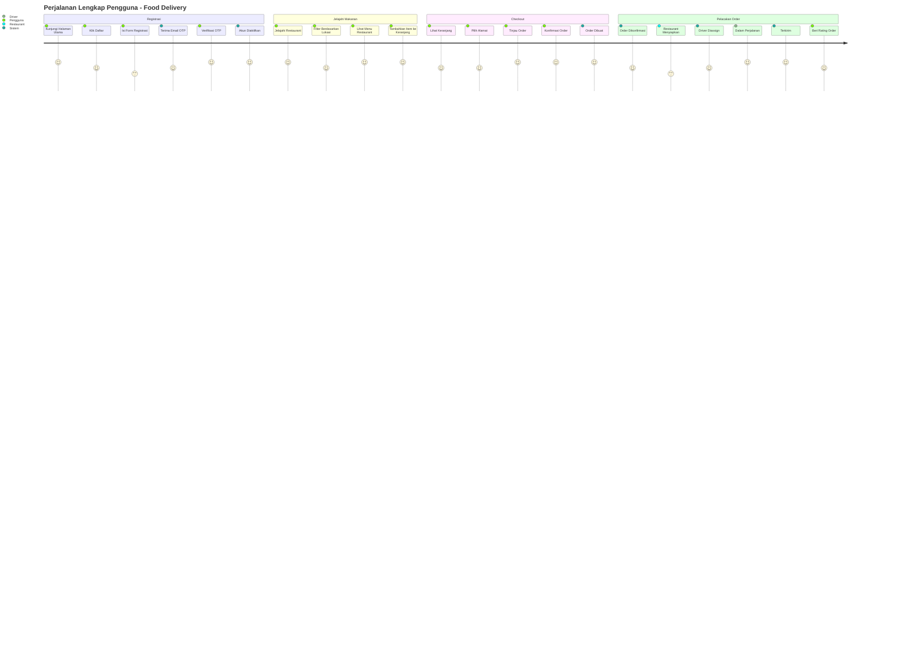

# 🗺️ MT Trans Food Delivery - Flowchart Lengkap Project

## 📋 Daftar Isi
0. [⭐ Flowchart Lengkap (Semua Alur dalam Satu Diagram)](#0-flowchart-lengkap-semua-alur-dalam-satu-diagram)
1. [Gambaran Arsitektur Sistem](#1-gambaran-arsitektur-sistem)
2. [Alur Autentikasi Pengguna](#2-alur-autentikasi-pengguna)
3. [Alur Pemesanan Makanan](#3-alur-pemesanan-makanan)
4. [Alur Proses Order](#4-alur-proses-order)
5. [Alur Admin Panel](#5-alur-admin-panel)
6. [Struktur Backend API](#6-struktur-backend-api)
7. [Alur Layanan Pengiriman](#7-alur-layanan-pengiriman)

---

## 0. ⭐ Flowchart Terpisah (3 Flowchart Fokus)

**Rekomendasi: Gunakan 3 flowchart terpisah ini untuk memahami alur sistem dengan lebih fokus!**

Flowchart telah dipecah menjadi 3 bagian terpisah untuk memudahkan pemahaman:

### 👤 **Flowchart User Flow** (Section 0 di MERMAID_LIVE_EDITOR.md)
- ✅ Alur Autentikasi (Login, Registrasi, OTP)
- ✅ Alur Pemesanan Makanan (Browse, Cart, Checkout)
- ✅ Alur Profile (Edit Profile, Kelola Alamat, Ubah Password)
- ✅ Alur Orders (Lihat Orders, Detail Order, Lacak Order)

### 🔧 **Flowchart Admin Flow** (Section 1 di MERMAID_LIVE_EDITOR.md)
- ✅ Login Admin
- ✅ Dashboard Analytics
- ✅ Manajemen Orders (Lihat, Detail, Update Status)
- ✅ Manajemen Users (Lihat, Detail, Toggle Status)
- ✅ Manajemen Restaurants (Lihat, Edit, Kelola Menu)
- ✅ Pelacakan Deliveries
- ✅ Analytics Dashboard
- ✅ Manajemen Ongkir
- ✅ Settings

### 🚚 **Flowchart Shipping Flow** (Section 2 di MERMAID_LIVE_EDITOR.md)
- ✅ Cek Ongkir (Kirim Barang)
- ✅ Ekspedisi Lokal
- ✅ Multi Drop
- ✅ Tracking Pengiriman (Pending → Assigned → Picked Up → In Transit → Delivered)

**Lihat file `MERMAID_LIVE_EDITOR.md` untuk 3 flowchart terpisah yang bisa langsung di-copy ke Mermaid Live Editor.**
**Atau lihat file `FLOWCHART_LENGKAP.md` untuk versi lengkap dengan penjelasan.**

---

## 1. Gambaran Arsitektur Sistem

---

## 2. Alur Autentikasi Pengguna

---

## 3. Alur Pemesanan Makanan

---

## 4. Alur Proses Order

---

## 5. Alur Admin Panel

---

## 6. Struktur Backend API

---

## 7. Alur Layanan Pengiriman

---

## 📊 ERD Database Lengkap

**Entity Relationship Diagram lengkap untuk seluruh sistem MT Trans Food Delivery**

ERD ini menampilkan semua entities, atribut, dan relasi dalam sistem:

### Core Entities
- **USERS** - Pengguna aplikasi dengan autentikasi lengkap
- **ADDRESSES** - Alamat pengguna dengan nama penerima
- **RESTAURANTS** - Restaurant dengan rating dan status
- **MENUS** - Menu restaurant dengan kategori dan ketersediaan
- **CARTS** - Keranjang belanja pengguna
- **CART_ITEMS** - Item dalam keranjang
- **ORDERS** - Pesanan dengan detail lengkap
- **ORDER_ITEMS** - Item dalam pesanan
- **DELIVERIES** - Pengiriman dengan berbagai tipe
- **MULTI_DROP_LOCATIONS** - Lokasi multi drop
- **SHIPPING_MANAGERS** - Shipping manager per zone
- **DRIVERS** - Driver pengiriman dengan tracking

### Auth & Security Entities
- **OTP_VERIFICATIONS** - Verifikasi OTP untuk registrasi
- **PENDING_USERS** - User yang belum verifikasi
- **TOKEN_BLACKLIST** - Token yang di-blacklist

### Ongkir Entities
- **ONGKIR_CITIES** - Kota dengan zone dan multiplier
- **ONGKIR_SERVICES** - Layanan ongkir (Reguler, Express, Ekonomis)
- **ONGKIR_PRICING** - Pricing antar kota
- **ONGKIR_ZONE_TARIFFS** - Tarif antar zone

**Lihat ERD lengkap di:**
- **MERMAID_LIVE_EDITOR.md** - Section 8: ERD Database Lengkap
- **FLOWCHART_LENGKAP.md** - Section 3: ERD Database Lengkap

ERD lengkap mencakup semua atribut, primary keys (PK), foreign keys (FK), unique keys (UK), dan relasi dengan cardinality yang benar.

---

## 🔄 Perjalanan Lengkap Pengguna

---

## 📝 Catatan

- **Aplikasi Frontend User**: Aplikasi Next.js untuk pengguna akhir
- **Panel Admin**: Aplikasi Next.js terpisah untuk manajemen admin
- **Backend API**: REST API NestJS
- **Database**: PostgreSQL dengan TypeORM
- **Autentikasi**: Token JWT (24 jam akses, 30 hari refresh) + verifikasi OTP
- **Pembayaran**: Hanya Cash on Delivery
- **Biaya Pengiriman**: Tarif flat Rp 15.000 untuk food delivery
- **Biaya Aplikasi**: 10% dari subtotal
- **Format Nomor Order**: MT-XXXXXX (alphanumeric)

---

**Dibuat untuk Project MT Trans Food Delivery**
**Terakhir Diupdate**: 2025
